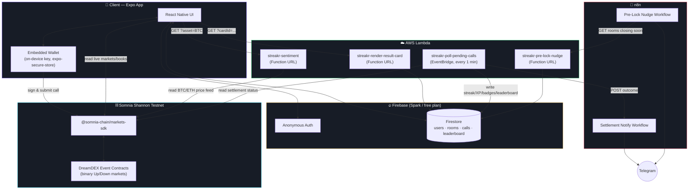
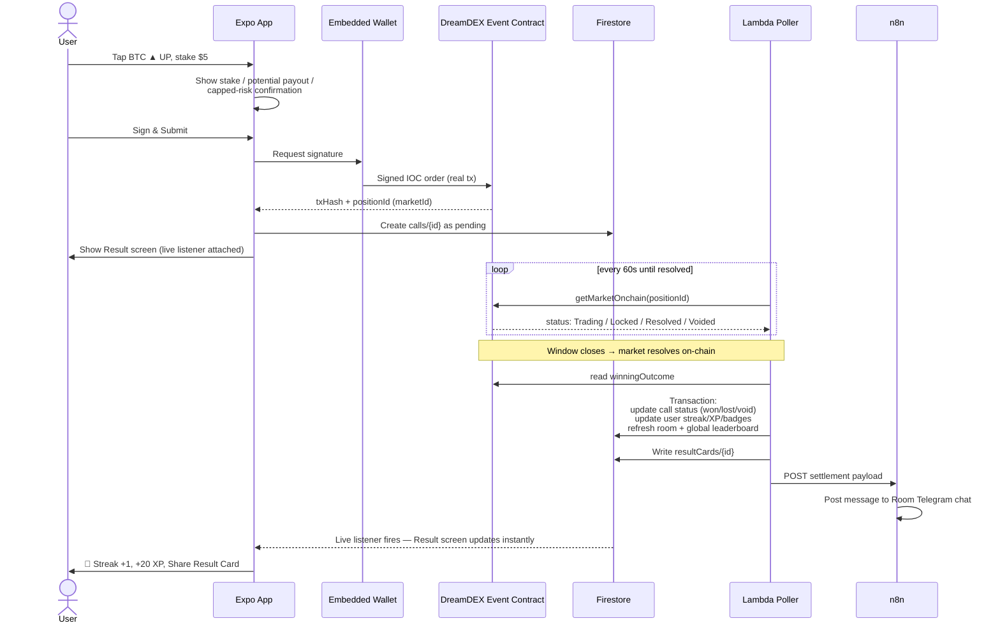
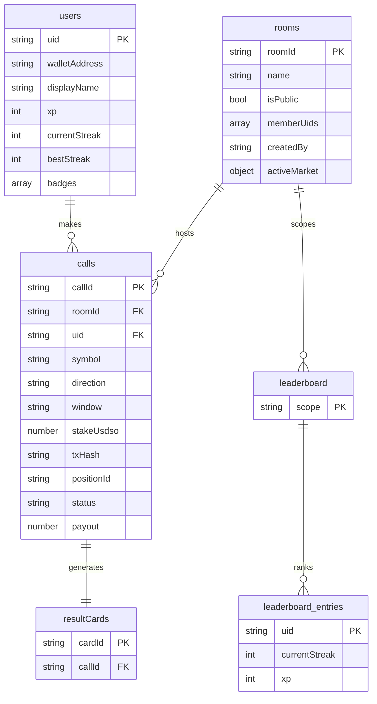

<div align="center">

# 🔥 Streakr

**A social, gamified prediction game built on DreamDEX Event Contracts (Somnia L1)**

Call BTC or ETH. Up or Down. Real wallet-signed calls, settled automatically from real on-chain outcomes.
No liquidation. No margin. Loss capped at your stake.

[](https://streakr-opal.vercel.app)
[](https://docs.dreamdex.io)

</div>

---

Every on-chain call in this repo's history is real — signed and submitted on
Shannon testnet, settled from real on-chain outcomes. No simulated trades,
no mocked settlements, anywhere in this codebase.

## Contents

- [What it is](#what-it-is)
- [Architecture](#architecture)
- [Call lifecycle](#call-lifecycle)
- [Data model](#data-model)
- [Repo layout](#repo-layout)
- [Key design decisions](#key-design-decisions)
- [Setup](#setup)
- [Testing a full call cycle](#testing-a-full-call-cycle)
- [Verified on-chain](#verified-on-chain)
- [DreamDEX SDK feedback](#dreamdex-sdk--docs-feedback)
- [Deliverables checklist](#deliverables-checklist)

---

## What it is

DreamDEX Event Contracts let anyone pick BTC or ETH, choose a 15-minute or
1-hour window, and call **Up** or **Down**. Right, and you get a fixed
payout. Wrong, and you lose exactly your stake — nothing more, no margin
call, no liquidation.

Streakr wraps that primitive in a social layer:

| Feature | What it does |
|---|---|
| 🏠 **Rooms** | Create or join a room (public or private), tied to a live BTC/ETH market |
| ✍️ **Real calls** | Every Up/Down is a wallet-signed transaction on the actual DreamDEX order book — never simulated |
| 🔥 **Streaks** | Consecutive correct calls build a streak; one loss resets it to zero |
| ⭐ **XP & badges** | First Call, 3/5/10-streak, and Room Champion badges, all server-verified |
| 🏆 **Leaderboards** | Per-room and global, ranked by streak then XP, live via Firestore listeners |
| 🖼️ **Result Cards** | A shareable image generated the moment a call settles — the viral loop |
| 🤖 **Momentum read** | One plain-English sentence built from real recent window outcomes, labelled "AI take, not advice" — informational only, never places a trade. Ships with a deterministic template; set `LLM_API_KEY` on the sentiment Lambda for LLM phrasing of the same data |

## Architecture

Three independent deployables, one shared source of truth (Firestore), and
one source of real money movement (the Somnia chain itself):



**Why AWS Lambda instead of Firebase Cloud Functions:** Firestore and
Firebase Auth stay on Firebase's free Spark plan. Cloud Functions requires
the paid Blaze plan even at free-tier-sized usage, so all backend *logic*
(settlement polling, sentiment, Result Card rendering, pre-lock nudges) runs
on AWS Lambda instead, talking to the same Firestore database via
`firebase-admin` with a service-account credential. See
[`backend/lambda/DEPLOY.md`](backend/lambda/DEPLOY.md) for the full deploy
walkthrough.

## Call lifecycle

What actually happens between a tap and a settled streak:



The key property: **Streakr never decides who won.** `judgeCall()` only
reads `onchain.winningOutcome` from the real settled market — the same
authoritative status every other DreamDEX client reads, never the lagging
indexer.

## Data model



Firestore security rules ([`backend/firestore.rules`](backend/firestore.rules))
enforce the trust boundary directly: a client can create its **own** call,
only in `status: "pending"`, only with a real `txHash`/`positionId` already
attached — and can never write `status`, `payout`, streaks, XP, badges, or
leaderboard entries. Those are exclusively written by the Lambda settlement
poller via the Admin SDK, which bypasses rules entirely. The whole point of
Streakr is that outcomes come from the chain, not from a client claiming a win.

## Repo layout

```
Streakr/
├── chain-integration/    DreamDEX Bot Kit (cloned + extended)
│   └── scripts/
│       ├── ec-doctor.ts                    preflight: venue + wallet check
│       ├── place-event-contract-call.ts    real signed call submission
│       ├── watch-settlement.ts             poll on-chain status → WIN/LOSS/VOID
│       └── fund-collateral.ts              testnet tUSDC faucet helper
│
├── backend/
│   ├── firestore.rules            security rules — client create-only
│   ├── firestore.indexes.json     composite indexes for calls/rooms/leaderboard queries
│   └── lambda/                    AWS Lambda handlers (NOT Cloud Functions)
│       ├── src/handlers/
│       │   ├── pollPendingCalls.ts      settlement sweep, every 1 min (EventBridge)
│       │   ├── faucet.ts                grants a new wallet gas + collateral
│       │   ├── sentiment.ts             momentum one-liner
│       │   ├── renderResultCard.ts      SVG share-card generator
│       │   └── preLockNudge.ts          "2 min to lock" data for n8n
│       └── DEPLOY.md              AWS CLI deploy walkthrough, per function
│
├── app/                  Expo (React Native) — the actual product
│   └── src/
│       ├── lib/           wallet, chain client, Firestore API, session
│       ├── screens/       Onboarding, RoomList, Room, CallConfirm, Result, Profile, Leaderboard
│       └── components/    design-system primitives (Card, GradientButton, Countdown, …)
│
└── n8n-workflows/        Telegram settlement notify + pre-lock nudge (JSON exports)
```

## Key design decisions

<details>
<summary><strong>Event Contracts use <code>ec-core</code>, not the spot/perp CLOB path</strong></summary>

<br>

The original brief described using the Bot Kit's `Pool.load` /
`createChainContext` / `topOfBook()` pattern. That's the **spot/perp CLOB**
path, not Event Contracts. Event Contracts have their own dedicated package,
`packages/ec-core`, built on `@somnia-chain/markets-sdk`, with its own
preflight script (`scripts/ec-doctor.ts`) and reference strategies
(`ec-starter`, `ec-settlement`, etc.) — confirmed directly against
[docs.dreamdex.io/developers/event-contracts](https://docs.dreamdex.io/developers/event-contracts).
`chain-integration/` uses the correct EC-specific tooling throughout.

</details>

<details>
<summary><strong>Embedded wallet instead of WalletConnect</strong></summary>

<br>

The brief allowed either. DreamDEX's own bot-kit onboarding is itself just a
raw private key in `.env` — there's no WalletConnect flow to mirror anywhere
in the Bot Kit or the Event Contracts docs, and a real WalletConnect (Reown)
integration needs a registered Project ID nobody provided here. So the app
generates a private key on-device on first launch, stores it in the OS
keychain via `expo-secure-store`, and never lets it leave the device. Every
call is still a real signed transaction through the exact same SDK path the
CLI scripts use. Swapping in a real WalletConnect signer later would only
touch `app/src/lib/wallet.ts` — nothing downstream cares how the private key
was obtained.

</details>

<details>
<summary><strong>AWS Lambda instead of Firebase Cloud Functions</strong></summary>

<br>

Firestore and Firebase Auth are both free on the Spark plan. Cloud Functions
requires the paid Blaze plan even at free-tier usage volumes, so all backend
logic was rebuilt as four plain Lambda handlers instead, talking to the same
Firestore via a service-account credential. The Result Card renderer uses
hand-built SVG rather than `@napi-rs/canvas` for the same reason canvas
libraries are a bad fit for a hand-uploaded Lambda zip: they ship
prebuilt native binaries keyed to a specific OS/architecture, which is
exactly the kind of thing that silently breaks when built on a Mac and run
on Amazon Linux. SVG has zero native dependencies and is still a real,
shareable image.

</details>

<details>
<summary><strong>Settlement is polled, not event-triggered</strong></summary>

<br>

Nothing about a `calls` document changes on its own when a market settles —
the state change happens on-chain, and something has to go *look*. A
Firestore `onUpdate` trigger has nothing to react to. So `pollPendingCalls`
runs on an EventBridge schedule every 60 seconds, scans every `pending` call,
and reads each one's real on-chain status directly — gating on the
authoritative on-chain `MarketStatus`, never the (seconds-lagging) indexer.

</details>

## Setup

### 1 · Chain integration

```bash
cd chain-integration
npm install
cp .env.example .env
```

Edit `.env`:

| Variable | Value | Why |
|---|---|---|
| `PRIVATE_KEY` | a **fresh** testnet-only key | never reuse a real wallet key — generate one with `node -e "console.log(require('viem/accounts').generatePrivateKey())"` |
| `NETWORK` | `testnet` | default |
| `MM_LOT` | `1000` | **required.** Measured against the live venue: it enforces a 1000-raw-unit lot grid, not the bot-kit's documented default of `1` — omitting this reverts every order with `InvalidQuantity` |

Fund the wallet:

1. **Gas (STT)** — [Somnia Shannon faucet](https://t.me/+XHq0F0JXMyhmMzM0) (hackathon Telegram) or the Google Cloud Web3 faucet
2. **Collateral (tUSDC)** — self-serve once gas lands: `npx tsx scripts/fund-collateral.ts` (mints 10,000 tUSDC via the SDK's public testnet faucet)

Verify:

```bash
npx tsx scripts/ec-doctor.ts   # Event Contracts venue + wallet check
```

### 2 · Backend — Firestore

```bash
cd backend
firebase login
firebase use --add
firebase deploy --only firestore
```

In the Firebase console:
- **Build → Firestore Database** → create one if needed
- **Build → Authentication → Sign-in method** → enable **Anonymous**
- **Project settings → General** → add a Web app → copy config into `app/.env`
- **Project settings → Service accounts** → generate a private key → you'll need this JSON for step 3

### 3 · Backend — AWS Lambda

```bash
cd backend/lambda
npm install
npm run test        # 10 unit tests on streak/XP/badge logic
npm run package      # bundles + zips all 4 handlers into deploy/*.zip
```

Then follow **[`backend/lambda/DEPLOY.md`](backend/lambda/DEPLOY.md)** —
creating the 4 functions, uploading the zips, env vars, the EventBridge
schedule, and Function URLs.

### 4 · App

```bash
cd app
npm install
cp .env.example .env    # fill in Firebase config + the 2 Lambda Function URLs
npm run web              # fastest for a demo
```

### 5 · n8n *(not deployed)*

> The two workflows below are exported and wired to a live endpoint
> (`streakr-pre-lock-nudge`), but **no n8n instance is currently running**, and
> `N8N_SETTLEMENT_WEBHOOK_URL` is deliberately unset on the settlement poller.
> Settlement, streaks, XP and leaderboards all work without it — the poller logs
> a warning and continues. What's missing is only the Telegram ping. The
> architecture diagram above shows this path; treat it as designed and endpointed
> rather than live.


Import both files in `n8n-workflows/` into an n8n instance — each has a
`notes` field listing exactly which credentials/env vars it needs. Without
this, calls still settle and streaks still update; you just don't get
Telegram pings.

## Testing a full call cycle

```mermaid
flowchart LR
    A[Connect Wallet] --> B[Create / Join Room]
    B --> C[Pick BTC/ETH + window]
    C --> D[Tap Up or Down]
    D --> E[Confirm stake & risk]
    E --> F[Sign & Submit]
    F --> G["Wait for window to close<br/>(Lambda polls every 60s)"]
    G --> H["Result updates live<br/>(Firestore listener)"]
    H --> I[Streak / XP / Badges update]
    I --> J[Share Result Card]
```



1h windows are the safest bet for a live demo — 15m windows may not be
running on the venue at every moment; the Room screen tells you if the
window you picked isn't currently live.

## Verified on-chain

Two real calls were placed and watched through to real settlement while
building this:

| Call | Window | Market resolved | Result | Payout |
|---|---|---|---|---|
| BTC **UP** | 1h | YES / Up | ✅ **WIN** | full payout |
| ETH **DOWN** | 1h | YES / Up | ❌ **LOSS** | $0 — capped exactly at stake |

Both went through `chain-integration/scripts/place-event-contract-call.ts`
(real signed IOC order) and were tracked by
`chain-integration/scripts/watch-settlement.ts` to real on-chain resolution.

## DreamDEX SDK & docs feedback

- **Lot-size default is stale for at least one live testnet venue.** The
  bot-kit's `packages/ec-core/src/config.ts` documents testnet as having "no
  lot constraint in practice" (`MM_LOT=1`). Measured against the live
  Shannon testnet venue: every order at that default reverted with
  `InvalidQuantity(<requested>, 1000)` — the venue actually enforces a
  1000-raw-unit lot grid.
- **The main Bot Kit README and the Event Contracts docs disagree on which
  primitive to use.** The top-level README's overview table describes
  `packages/core` / `Pool.load` as *the* client pattern and never mentions
  `packages/ec-core` — you only find it by drilling into `strategies/ec-*`
  or reading `docs/event-contracts.md` directly. A newcomer following the
  top-level quickstart would build against the wrong primitive for a binary
  market.
- **No documented wallet-onboarding pattern** (WalletConnect or otherwise)
  exists anywhere in the Bot Kit or Event Contracts docs — everything
  assumes a raw `PRIVATE_KEY` in `.env`. For anything with a real end user
  (not a bot), that's a real gap.
- **`estPayoutFor`'s settlement fee isn't easily discoverable read-only.**
  `settlementFeeBps` needs either an indexer row with fee fields populated,
  or a signer-free on-chain read through a hand-copied minimal ABI — there's
  no plain read method on the unified SDK surface for it.

## Deliverables checklist

- [x] Working prototype on Somnia testnet — real Event Contract calls, not mocked
- [x] Public GitHub repo, clean README — [github.com/Spydiecy/Streakr](https://github.com/Spydiecy/Streakr)
- [x] All chain interactions traceable to real testnet tx hashes
- [x] Real DreamDEX Event Contracts integration, social/gamified UX, light AI feature
- [x] DreamDEX docs/SDK feedback flagged above

---

<div align="center">
<sub>Built for a hackathon. Testnet funds only. Not financial advice.</sub>
</div>
