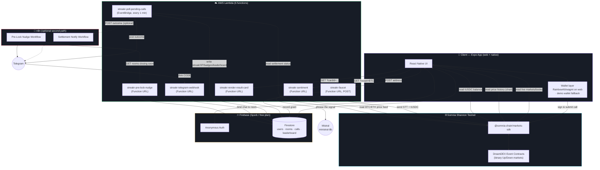
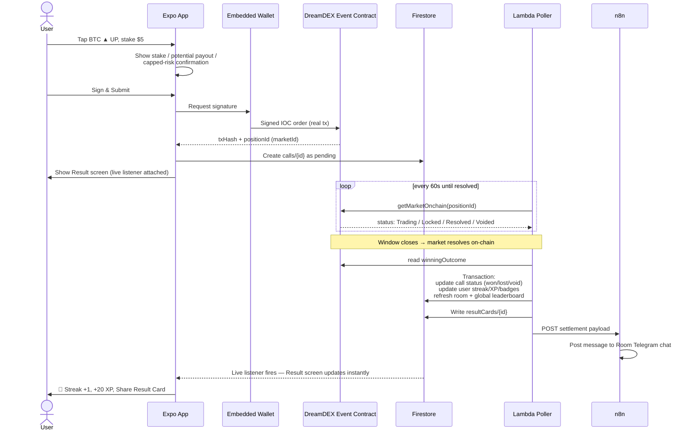
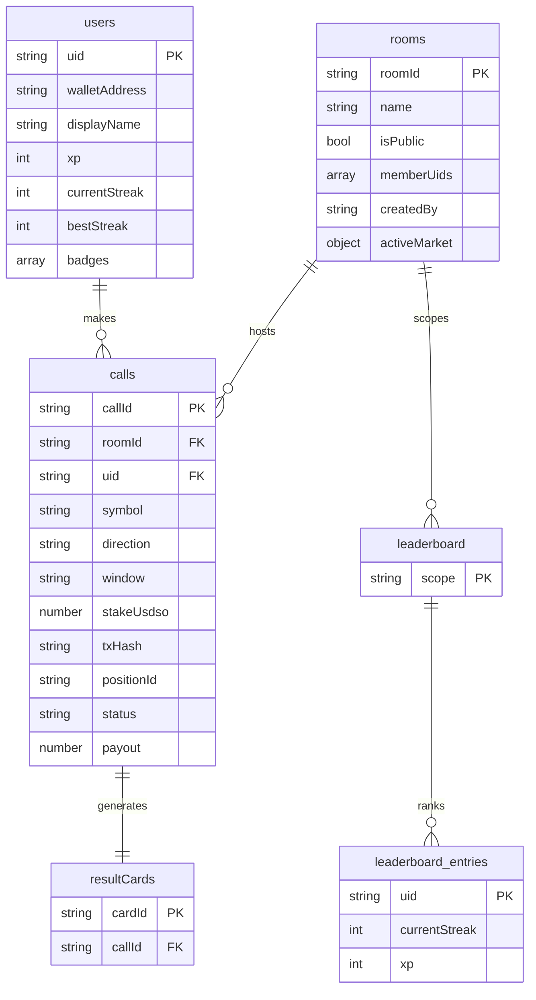

<div align="center">

# 🔥 Streakr

**A social, gamified prediction game built on DreamDEX Event Contracts (Somnia L1)**

Call BTC or ETH. Up or Down. Real wallet-signed calls, settled automatically from real on-chain outcomes.
No liquidation. No margin. Loss capped at your stake.

[](https://streakr-opal.vercel.app)
[](https://docs.dreamdex.io)

</div>

---

Every on-chain call in this repo's history is real — signed and submitted on
Shannon testnet, settled from real on-chain outcomes. No simulated trades,
no mocked settlements, anywhere in this codebase.

## Contents

- [What it is](#what-it-is)
- [Architecture](#architecture)
- [Call lifecycle](#call-lifecycle)
- [Data model](#data-model)
- [Repo layout](#repo-layout)
- [Key design decisions](#key-design-decisions)
- [Setup](#setup)
- [Testing a full call cycle](#testing-a-full-call-cycle)
- [Verified on-chain](#verified-on-chain)
- [Demo walkthrough](DEMO.md) → shot-by-shot script, plus what to check first
- [DreamDEX SDK feedback](#dreamdex-sdk--docs-feedback) → full write-up in [`FEEDBACK.md`](FEEDBACK.md)
- [Deliverables checklist](#deliverables-checklist)

---

## What it is

DreamDEX Event Contracts let anyone pick BTC or ETH, choose a window, and call
**Up** or **Down**. Right, and the position redeems at a fixed payout. Wrong, and
you lose exactly your stake — nothing more, no margin call, no liquidation.

Streakr offers whichever of 15m / 1h / 4h / 1d the venue is actually running,
read from live markets rather than hard-coded, because the venue rotates its
cadences and a fixed list shows the user an empty screen through no fault of
their own.

Streakr wraps that primitive in a social layer:

| Feature | What it does |
|---|---|
| 🏠 **Rooms** | Create or join a room (public or private), tied to a live BTC/ETH market. Creator-only delete, which tells you whether the room still holds calls before you confirm |
| 💬 **Room feed** | Every call made in the room, newest first, with pending ones shown live — the shared surface that makes a room feel like a group rather than a scoreboard |
| ✍️ **Real calls** | Every Up/Down is a wallet-signed transaction on the actual DreamDEX order book — never simulated. Collateral is checked *before* signing, so an empty wallet is caught without spending gas |
| 🔥 **Streaks** | Consecutive correct calls build a streak; one loss resets it to zero |
| ⭐ **XP & badges** | First Call, 3/5/10-streak, and Room Champion badges, all server-verified |
| 🏆 **Leaderboards** | Per-room and global, ranked by streak then XP, live via Firestore listeners |
| 🧾 **Explained results** | Each settled call says what actually happened — "Closed Up — won 16.67 tUSDC (+11.67 profit)" — with the resolved leg derived from the verdict and the amount valued from the on-chain share count |
| 📈 **Price chart** | A sparkline of recent closes for the asset being called, sized to the window (minute candles for 15m, hourly for 1d), from the same oracle feed the momentum line reads — so the chart and the AI take can't contradict each other |
| 🔔 **Telegram** | Every settlement posts to the room's own group chat — linked with `/link CODE` — carrying the streak and a link to the transaction, so a result is verifiable rather than asserted |
| 💰 **Claim winnings** | A resolved Event Contract doesn't pay out on its own — winning outcome tokens sit in the wallet until they're burned for the collateral behind them. Won calls carry a **Claim** action that redeems the position and moves the tUSDC into the wallet for real |
| 🖼️ **Result Cards** | A shareable SVG generated the moment a call settles — the viral loop |
| 🤖 **Momentum read** | One plain sentence phrased by Mistral `ministral-8b` from real recent window outcomes, labelled "AI take, not advice". The signal is the substance; the model only does wording, and falls back to a deterministic template on any failure so a third party can't break the room card |
| 🚰 **Zero-setup onboarding** | A new wallet is granted testnet gas + collateral server-side, so a visitor can place a real call in under a minute |

## Architecture

Three independent deployables, one shared source of truth (Firestore), and
one source of real money movement (the Somnia chain itself):



Solid edges are live. The one dotted edge is the poller → n8n webhook, which needs
n8n reachable at a public URL; the poller posts to Telegram directly regardless,
so notifications don't depend on it. See
[step 5](#5--telegram-notifications).

**Why AWS Lambda instead of Firebase Cloud Functions:** Firestore and
Firebase Auth stay on Firebase's free Spark plan. Cloud Functions requires
the paid Blaze plan even at free-tier-sized usage, so all backend *logic*
(settlement polling, sentiment, Result Card rendering, pre-lock nudges) runs
on AWS Lambda instead, talking to the same Firestore database via
`firebase-admin` with a service-account credential. See
[`backend/lambda/DEPLOY.md`](backend/lambda/DEPLOY.md) for the full deploy
walkthrough.

## Call lifecycle

What actually happens between a tap and a settled streak:



The key property: **Streakr never decides who won.** `judgeCall()` only
reads `onchain.winningOutcome` from the real settled market — the same
authoritative status every other DreamDEX client reads, never the lagging
indexer.

## Data model



Firestore security rules ([`backend/firestore.rules`](backend/firestore.rules))
enforce the trust boundary directly: a client can create its **own** call,
only in `status: "pending"`, only with a real `txHash`/`positionId` already
attached — and can never write `status`, `payout`, streaks, XP, badges, or
leaderboard entries. Those are exclusively written by the Lambda settlement
poller via the Admin SDK, which bypasses rules entirely. The whole point of
Streakr is that outcomes come from the chain, not from a client claiming a win.

## Repo layout

```
Streakr/
├── chain-integration/    DreamDEX Bot Kit (cloned + extended)
│   └── scripts/
│       ├── ec-doctor.ts                    preflight: venue + wallet check
│       ├── place-event-contract-call.ts    real signed call submission
│       ├── watch-settlement.ts             poll on-chain status → WIN/LOSS/VOID
│       └── fund-collateral.ts              testnet tUSDC faucet helper
│
├── backend/
│   ├── firestore.rules            security rules — client create-only
│   ├── firestore.indexes.json     composite indexes for calls/rooms/leaderboard queries
│   └── lambda/                    AWS Lambda handlers (NOT Cloud Functions)
│       ├── src/handlers/
│       │   ├── pollPendingCalls.ts      settlement sweep, every 1 min (EventBridge)
│       │   ├── faucet.ts                grants a new wallet gas + collateral
│       │   ├── sentiment.ts             momentum one-liner
│       │   ├── renderResultCard.ts      SVG share-card generator
│       │   ├── preLockNudge.ts          "2 min to lock" data for n8n
│       │   └── telegramWebhook.ts       /link CODE -> bind a group to a room
│       └── DEPLOY.md              AWS CLI deploy walkthrough, per function
│
├── app/                  Expo (React Native) — the actual product
│   ├── src/
│   │   ├── lib/           wallet, chain client, Firestore API, session, error mapping
│   │   │   ├── chain.ts             SDK clients + the gas ceiling / fee override
│   │   │   ├── eventContracts.ts    market discovery, books, placeCall, claim, faucet
│   │   │   ├── errors.ts            chain/SDK/Firestore errors -> human sentences
│   │   │   ├── faucetApi.ts         client for the server-side funding grant
│   │   │   ├── networkConfig.ts     leaf module: network + collateral decimals
│   │   │   ├── WalletProvider.tsx   native: embedded wallet
│   │   │   └── WalletProvider.web.tsx  web: RainbowKit + demo fallback
│   │   ├── screens/       Onboarding, RoomList, Room, Result, Profile, Leaderboard
│   │   └── components/    CallSheet (confirm in place), ClaimRow (redeem a win),
│   │                      ScrollBox (capped lists) + design-system primitives
│   ├── e2e/               headless-Chrome checks against the real build + chain
│   └── scripts/           icon generation, build gates (asset relocation, env verify)
│
└── n8n-workflows/        Telegram settlement notify + pre-lock nudge (JSON exports)
```

### Platform splits

Metro resolves `.web.tsx` / `.web.ts` for the web target, so three modules exist
twice — each because the shared dependency genuinely has no browser
implementation:

| Module | Native | Web | Why |
|---|---|---|---|
| `WalletProvider` | embedded wallet | RainbowKit + wagmi | RainbowKit is browser-only (DOM modals, vanilla-extract CSS) |
| `firebase` | `getReactNativePersistence` | `browserLocalPersistence` | that export exists only in Firebase's react-native build |
| `keyStore` | `expo-secure-store` | `localStorage` | SecureStore has no web implementation at all |

## Key design decisions

<details>
<summary><strong>Event Contracts use <code>ec-core</code>, not the spot/perp CLOB path</strong></summary>

<br>

The original brief described using the Bot Kit's `Pool.load` /
`createChainContext` / `topOfBook()` pattern. That's the **spot/perp CLOB**
path, not Event Contracts. Event Contracts have their own dedicated package,
`packages/ec-core`, built on `@somnia-chain/markets-sdk`, with its own
preflight script (`scripts/ec-doctor.ts`) and reference strategies
(`ec-starter`, `ec-settlement`, etc.) — confirmed directly against
[docs.dreamdex.io/developers/event-contracts](https://docs.dreamdex.io/developers/event-contracts).
`chain-integration/` uses the correct EC-specific tooling throughout.

</details>

<details>
<summary><strong>Pinning the gas ceiling and fee — without this, no wallet can place a call</strong></summary>

<br>

The most consequential fix in the project, and it took a long time to find
because the error points somewhere else entirely.

A node requires the sender to hold `gasLimit × maxFeePerGas` before it will
*accept* a transaction, regardless of what the call actually burns. The SDK
defaults `gasLimit` to 10,000,000 and pins `maxFeePerGas` at 60 gwei — 10× the
6 gwei base fee — so **every write demanded 0.6 STT sitting idle**. That is far
more than a normal faucet grant, so a judge connecting their own MetaMask would
have failed exactly like our demo wallet did. This was never a demo-wallet
problem.

The fee is applied even when the trader is built with a viem `WalletClient` that
would otherwise estimate ~7.2 gwei itself, so changing transport achieves
nothing. Confirmed by decoding the raw signed transaction.

Both directions of misconfiguration fail, and neither mentions gas:

| Ceiling | Outcome | Reported as |
|---|---|---|
| too high | rejected pre-submission | `Missing or invalid parameters` — looks like bad calldata |
| too low | mined, reverted | `reverted (no revert data recoverable)` — looks like a contract bug |

Sizing is measured, not guessed: a plain ERC-20 `approve` on this chain estimates
at **1,389,617 gas** (Somnia's block limit is 15 billion, so its gas schedule is
not Ethereum's). A 400,000 ceiling burned all 400,000 and reverted.

`app/src/lib/chain.ts` therefore pins a 2,000,000 ceiling and overrides
`maxFeePerGas` to 12 gwei via a `Proxy` on the wallet client's write methods —
fees are chosen before the transport is reachable, so that's the last available
hook. Requirement per write drops from 0.6 STT to 0.024 STT, a 25× reduction.

Reproduce: `chain-integration/scripts/measure-gas.ts`, `measure-fees.ts`,
`repro-approve-revert.ts`.

</details>

<details>
<summary><strong>A server-side faucet, because a browser-made wallet can't bootstrap itself</strong></summary>

<br>

The demo wallet's key is generated in the browser, so it starts with 0 STT. STT
is the gas token, which means that wallet cannot send **any** transaction —
including the collateral token's own public `faucet()`, because that is itself a
transaction. It's a closed circle, and only something already holding gas can
break it.

Measured with `scripts/check-demo-wallet-funding.ts`:

```
fresh demo wallet   0 STT      0 tUSDC
project treasury    0.976 STT  9590 tUSDC
```

So funding moved server-side. `streakr-faucet` grants STT + tUSDC from the
treasury, with guards proportionate to spending real (testnet) funds: one grant
per address ever, a rolling 24h cap, a mainnet refusal, and a low-treasury
refusal so it fails loudly rather than half-funding an address. The grant record
is written *before* any transfer, so a racing duplicate loses on the create
instead of double-spending.

`faucetGrants` is closed to clients in `firestore.rules` — create access would let
an address lock itself out of funding, delete access would allow unbounded
re-requests.

</details>

<details>
<summary><strong>RainbowKit on web, embedded wallet as a labelled fallback</strong></summary>

<br>

RainbowKit is the primary path on web and the real answer for a consumer app.
But an external wallet a visitor brings holds no Shannon STT or tUSDC, and there
is no way to faucet *someone else's* wallet on their behalf — so a
RainbowKit-only build dead-ends at the first call. The demo wallet is auto-funded
(above), which keeps the full loop demonstrable, and it's labelled as such rather
than pretending to be the user's own wallet.

RainbowKit cannot run on native at all — browser DOM, vanilla-extract CSS, no
React Native support — so Metro's `.web` resolution keeps it out of the native
bundle entirely. The proper native equivalent is Reown AppKit for React Native,
noted as future work.

</details>

<details>
<summary><strong>AWS Lambda instead of Firebase Cloud Functions</strong></summary>

<br>

Firestore and Firebase Auth are both free on the Spark plan. Cloud Functions
requires the paid Blaze plan even at free-tier usage volumes, so all backend
logic was rebuilt as four plain Lambda handlers instead, talking to the same
Firestore via a service-account credential. The Result Card renderer uses
hand-built SVG rather than `@napi-rs/canvas` for the same reason canvas
libraries are a bad fit for a hand-uploaded Lambda zip: they ship
prebuilt native binaries keyed to a specific OS/architecture, which is
exactly the kind of thing that silently breaks when built on a Mac and run
on Amazon Linux. SVG has zero native dependencies and is still a real,
shareable image.

</details>

<details>
<summary><strong>Settlement is polled, not event-triggered</strong></summary>

<br>

Nothing about a `calls` document changes on its own when a market settles —
the state change happens on-chain, and something has to go *look*. A
Firestore `onUpdate` trigger has nothing to react to. So `pollPendingCalls`
runs on an EventBridge schedule every 60 seconds, scans every `pending` call,
and reads each one's real on-chain status directly — gating on the
authoritative on-chain `MarketStatus`, never the (seconds-lagging) indexer.

</details>

<details>
<summary><strong>Market discovery via <code>listBinaryMarkets</code>, not <code>loadMarkets</code></strong></summary>

<br>

Measured with `scripts/profile-market-reads.ts`:

| Call | Time | Scope |
|---|---|---|
| `loadMarkets(true)` | **18.06s** | 608 markets, every venue |
| `listBinaryMarkets({ venueId, status: "Trading", limit: 60 })` | **2.24s** | our venue only |
| `getMarketOnchain` ×50 parallel | 1.69s | |

8× faster is the smaller reason. The deciding one: `loadMarkets`' derived `active`
flag **hid a live BTC 1h market** that the indexer reported as `Trading` and that
we then traded against successfully. Trusting `active` shows the user fewer
markets than exist.

</details>

<details>
<summary><strong>Window labels snap to the nearest cadence, and the window list is derived</strong></summary>

<br>

Two separate traps in how the venue reports time.

**Cadence jitter.** `intervalSec` is derived from `expiry − tradingStart`, and
trading routinely opens a second or two late, so a 15-minute series is indexed as
899 or 898 as often as 900. Matching exactly returns `null`, the market gets
dropped, and the UI's window chips appear and disappear at random. Caught live by
`scripts/check-cadence-labels.ts` — an ETH series indexed at 899s. Labels now snap
to the nearest rung within a scaled tolerance.

**The venue rotates cadences.** At one point only 4h and 1d were live; at another
all of 15m/1h/4h/1d. It also runs series Streakr doesn't surface (1m, 5m, and
oddities like 3s and 52s). Hard-coding a window list shows the user an empty
screen through no fault of their own, so the list is derived from live markets via
`availableWindows()`.

</details>

<details>
<summary><strong>Each leg is priced from its own asks</strong></summary>

<br>

Deriving the DOWN price as `1 − yesBid` and then adding slippage moves the price
the **wrong direction**, so the IOC never crosses and returns unfilled with no
error at all — indistinguishable from an empty book. `getBinaryOrderBook(pool)`
returns all four sides, so each leg reads its own asks: `yesAsks` for UP,
`noAsks` for DOWN.

Related: the SDK resolves `placeOrder` even when the receipt status is
`reverted`, so a failed call looks successful unless checked explicitly. Streakr
checks, because otherwise it would record a database row for a transaction that
never happened.

</details>

<details>
<summary><strong>Errors are mapped to sentences a person can act on</strong></summary>

<br>

What reached the UI before was, verbatim:

```
@somnia-chain/markets-sdk: placeBinaryOrder reverted:
ERC20InsufficientBalance(0x2ec8175015Bef5ad1C0BE1587C4A377bC083A2d8, 0, 5000000)
```

`app/src/lib/errors.ts` maps observed failures to a title, one actionable
sentence, and a `kind` the screens branch on — so the funding case can render a
"Fund this wallet" button rather than just complaining. The example above becomes:

> **Not enough tUSDC** — This call needs 5.00 tUSDC but the wallet holds 0.00.

18 test cases cover it, asserting both the classification and that no SDK jargon
or wallet address survives into user copy. Collateral is also checked *before*
requesting a signature, so an underfunded wallet is caught without the user paying
gas to discover it.

</details>

## Setup

### 1 · Chain integration

```bash
cd chain-integration
npm install
cp .env.example .env
```

Edit `.env`:

| Variable | Value | Why |
|---|---|---|
| `PRIVATE_KEY` | a **fresh** testnet-only key | never reuse a real wallet key — generate one with `node -e "console.log(require('viem/accounts').generatePrivateKey())"` |
| `NETWORK` | `testnet` | default |
| `MM_LOT` | `1000` | **required.** Measured against the live venue: it enforces a 1000-raw-unit lot grid, not the bot-kit's documented default of `1` — omitting this reverts every order with `InvalidQuantity` |

Fund the wallet:

1. **Gas (STT)** — [Somnia Shannon faucet](https://t.me/+XHq0F0JXMyhmMzM0) (hackathon Telegram) or the Google Cloud Web3 faucet
2. **Collateral (tUSDC)** — self-serve once gas lands: `npx tsx scripts/fund-collateral.ts` (mints 10,000 tUSDC via the SDK's public testnet faucet)

Verify:

```bash
npx tsx scripts/ec-doctor.ts   # Event Contracts venue + wallet check
```

### 2 · Backend — Firestore

```bash
cd backend
firebase login
firebase use --add
firebase deploy --only firestore
```

In the Firebase console:
- **Build → Firestore Database** → create one if needed
- **Build → Authentication → Sign-in method** → enable **Anonymous**
- **Project settings → General** → add a Web app → copy config into `app/.env`
- **Project settings → Service accounts** → generate a private key → you'll need this JSON for step 3

### 3 · Backend — AWS Lambda

```bash
cd backend/lambda
npm install
npm run test        # 20 unit tests: streak/XP/badge logic + Telegram formatting
npm run package      # bundles + zips all 6 handlers into deploy/*.zip
```

Then follow **[`backend/lambda/DEPLOY.md`](backend/lambda/DEPLOY.md)** — the six
functions, env vars, the EventBridge schedule, and Function URLs.

| Function | Trigger | Purpose |
|---|---|---|
| `streakr-poll-pending-calls` | EventBridge, `rate(1 minute)` | reads on-chain settlement, writes streak/XP/badges/leaderboard |
| `streakr-faucet` | Function URL (POST) | grants a new wallet STT + tUSDC so it can transact at all |
| `streakr-sentiment` | Function URL (GET) | momentum signal, phrased by Mistral |
| `streakr-render-result-card` | Function URL (GET) | shareable SVG for a settled call |
| `streakr-pre-lock-nudge` | Function URL (GET + secret) | rooms closing soon, for n8n |
| `streakr-telegram-webhook` | Function URL (POST from Telegram) | `/link CODE` binds a group to a room |

Two optional env vars change behaviour rather than enabling it:

- `LLM_API_KEY` + `LLM_MODEL` on `streakr-sentiment` — without them the same
  signal renders through a deterministic template. Currently set to Mistral
  `ministral-8b-latest`. (Note the id is *ministral*, not *mistral* —
  `mistral-8b-latest` does not exist.)
- `N8N_SETTLEMENT_WEBHOOK_URL` on the poller — unset, so no Telegram ping. The
  poller logs a warning and continues; settlement is unaffected.

### 4 · App

```bash
cd app
npm install
cp .env.example .env    # Firebase config + the 3 Lambda Function URLs
npm run web              # fastest for a demo

npm run typecheck        # tsc --noEmit
npm run test             # 51 unit tests: error mapping, call outcomes, quote/book maths
npm run build:web        # clean export + asset relocation + build gates
```

`EXPO_PUBLIC_FAUCET_URL` is effectively required. Without it a browser-generated
demo wallet has no gas and cannot place a call — see the faucet decision above.

**Always build via `npm run build:web`, never a bare `expo export`.** It runs two
gates that catch failures which are otherwise invisible until production:

- **`relocate-vendor-assets.mjs`** — `expo export` mirrors an asset's source path
  into the output, so icon fonts land under `dist/assets/node_modules/...`. The
  Vercel CLI strips any path containing a `node_modules` segment from a static
  upload, so all 30 of them 404 *in production only* — icons render as blank boxes
  and the failed font fetch surfaces as an unhandled `NetworkError`. This moves
  them and rewrites the URLs.
- **`verify-web-build.mjs`** — Metro caches its env inlining, so editing `.env`
  without `--clear` ships a bundle carrying the *previous* `EXPO_PUBLIC_*` values
  with no warning at all. This asserts every value from `.env` is actually present
  in the output, and that no asset URL lacks a file on disk.

Icons are generated from the same source the UI uses — the Ionicons flame glyph on
the lime gradient, rendered from the real TTF in headless Chrome so the app icon
can't drift from the in-app mark:

```bash
node scripts/generate-icons.mjs
```

### 5 · Telegram notifications

There are **two independent paths**, and they compose — set either, or both.
Neither is required: settlement, streaks, XP and leaderboards work regardless.

Two notifications exist, and they are **not** delivered the same way:

| Notification | When | Status |
|---|---|---|
| **Settlement** — "X called BTC UP and won 16.67" | a call resolves on-chain | **live**, posted by the poller |
| **Pre-lock nudge** — "your window locks in 2 minutes" | 0–120s before a window closes | **needs n8n running** — see B |

### Per-room chats

Each room shows a code (`/link ABC123`). Send it in any Telegram group that has
`@streak_r_bot` in it, and that room's settled calls post there instead of the
shared fallback chat. `/unlink` detaches.

`streakr-telegram-webhook` handles it. A webhook rather than polling
`getUpdates`, because polling needs a scheduler, holds an offset cursor, and
breaks if anything else consumes the same feed.

Two things it gets right that are easy to miss:

- **Telegram echoes a secret header** (`x-telegram-bot-api-secret-token`), which
  is checked. Without it, anyone who found the Function URL could forge an update
  and repoint any room's notifications at a chat they control.
- **`telegramChatId` is not client-writable.** `firestore.rules` limits client
  room updates to `name` / `activeMarket` / `isPublic`, so only the webhook (admin
  SDK) can set it. The `linkCode` is a claim ticket rather than a secret —
  claiming it only redirects that room's own notifications.

Group messages arrive addressed to the bot (`/link@streak_r_bot abc123`), so the
command parser handles the mention and is case-insensitive on the code.

```bash
# One-time registration; Telegram remembers it.
curl "https://api.telegram.org/bot<token>/setWebhook" -H 'content-type: application/json' \
  -d '{"url":"<function url>","secret_token":"<secret>","allowed_updates":["message","edited_message","channel_post"]}'
curl "https://api.telegram.org/bot<token>/getWebhookInfo"   # verify, check last_error_message
```

The nudge is different because `streakr-pre-lock-nudge` is only a *read* endpoint:
it answers "which rooms are about to lock?" and sends nothing itself. Something
has to both call it on a schedule and post the result, which is n8n's job. With
n8n down, nobody asks, so no nudges go out. Settlement notifications are
unaffected.

**A · Direct from the Lambda** *(live)*

The poller posts the outcome straight to the Bot API. No hosting, nothing to keep
awake, so this is the one that survives a closed laptop:

```bash
aws lambda update-function-configuration --function-name streakr-poll-pending-calls \
  --environment '{"Variables":{...,"TELEGRAM_BOT_TOKEN":"<token>","TELEGRAM_CHAT_ID":"<chat id>"}}'
```

Get a token from [@BotFather](https://t.me/BotFather), add the bot to a group,
send one message there, then read the chat id from
`https://api.telegram.org/bot<token>/getUpdates`. **A group chat id is negative**
(e.g. `-5298062119`).

Message text is built in `src/telegram.ts` and covered by 10 unit tests — mostly
around MarkdownV2 escaping, since a single unescaped `.` or `_` makes Telegram
reject the whole send, and display names and badge keys are full of them.

**B · Via n8n** *(workflows import and run; no instance currently hosted)*

Richer if you want to branch or add steps. Import without touching the UI:

```bash
npm install -g n8n
n8n import:credentials --input=telegram-cred.json   # {"type":"telegramApi","data":{"accessToken":"..."}}
n8n import:workflow --separate --input=n8n-workflows/
n8n update:workflow --id=<id> --active=true         # both workflows

N8N_BLOCK_ENV_ACCESS_IN_NODE=false \
STREAKR_PRE_LOCK_NUDGE_URL="<nudge Function URL>" \
STREAKR_N8N_SHARED_SECRET="<must equal N8N_SHARED_SECRET on that Lambda>" \
STREAKR_DEFAULT_TELEGRAM_CHAT_ID="<chat id>" \
n8n start
```

The two workflows have different reachability needs, which is worth knowing
before choosing where to host:

| Workflow | Direction | Needs a public URL? |
|---|---|---|
| Pre-Lock Nudge | schedule, calls **out** to the nudge Lambda | **no** — works from a local n8n |
| Settlement Notify | **receives** a POST from the poller | **yes** — set `N8N_SETTLEMENT_WEBHOOK_URL` to its production webhook |

`n8n start --tunnel` was removed in n8n 2.x, so exposing the webhook now means
hosting n8n somewhere reachable (n8n Cloud, or Docker on a small box) rather than
tunnelling from a laptop. A notification that only works while a laptop is awake
isn't a working feature, which is why the settlement path was moved into the
always-on Lambda and n8n's copy of it is redundant. Its one unique contribution
is the nudge.

Both workflows were verified working: imported via CLI, credentialed, activated,
and recorded `success` executions against the live bot. Making the nudge always-on
without n8n would mean an EventBridge rule plus letting the nudge Lambda post
directly — the same shape as path A.

## Testing a full call cycle

```mermaid
flowchart LR
    A[Connect Wallet] --> B[Create / Join Room]
    B --> C[Pick BTC/ETH + window]
    C --> D[Tap Up or Down]
    D --> E[Confirm stake & risk]
    E --> F[Sign & Submit]
    F --> G["Wait for window to close<br/>(Lambda polls every 60s)"]
    G --> H["Result updates live<br/>(Firestore listener)"]
    H --> I[Streak / XP / Badges update]
    I --> J[Share Result Card]
```



**Two things to know before demoing**, both venue behaviour rather than app bugs:

- **Check the book before tapping.** The venue frequently quotes only one leg
  (`UP 0.020  DOWN —`). Calling the unpriced side cannot fill; the app says
  "Nobody on the other side" honestly, but pick the side showing a number.
- **15m windows settle inside a demo**; 1h takes up to an hour. Both are usually
  live, and the window chips only ever show cadences the venue is actually
  running.

### Browser checks

`app/e2e/` drives the real exported build against live Somnia testnet and the real
Firestore project — no mocks, because most of this app's actual failures only
appear in a browser against live data (a react-native-web layout collapsing to
`height: 0` with no console error; fonts 404ing only in production; a lost race
between market reads).

```bash
npm i -D puppeteer-core          # not a runtime dep, drives system Chrome
npm run build:web && npx http-server dist -p 8899

node e2e/flow.mjs     http://localhost:8899        # onboarding -> room -> live markets
node e2e/switch.mjs   http://localhost:8899        # no stale data on asset/window switch
node e2e/roomfeed.mjs http://localhost:8899        # a placed call appears in the room
node e2e/fullcall.mjs http://localhost:8899        # the whole loop, real signed tx
node e2e/errpath.mjs  http://localhost:8899        # funding gate, no raw SDK jargon on screen
node e2e/history.mjs  http://localhost:8899        # settled rows explain themselves
node e2e/align.mjs    http://localhost:8899 1512   # measures rendered layout geometry
node e2e/scrollbox.mjs http://localhost:8899       # long lists cap and scroll in place
node e2e/claim.mjs    http://localhost:8899 4      # redeeming a win raises the balance
```

Each exits non-zero on failure. Point any of them at the deployed URL to check
production instead.

## Verified on-chain

Every call below was signed, submitted and settled for real on Shannon testnet.

**Through the app** — 13 calls settled, 9 won and 4 lost, each one a real signed
transaction valued from its real on-chain resolution. A representative win, with
every figure read back out of Firestore after the poller settled it:

| Field | Value |
|---|---|
| Call | BTC **UP**, 15m window |
| Staked | 5.00 tUSDC |
| Filled | 16.666 shares at **0.300** entry (a 27% implied chance) |
| Resolved | Up — the called direction |
| Payout | **16.666 tUSDC** → +11.666 profit |
| Written | streak 1, +20 XP, `first_call` badge, room + global leaderboard |
| Notified | posted to the room's Telegram with the tx link |

That payout is the whole point of the share count: a winning outcome token
redeems for ~1 collateral, so `5.00 / 0.300 = 16.67`. An earlier version computed
the payout from the stake instead and reported **5.00** on that same call, making
every win look like break-even.

A loss resets the streak to zero while still awarding XP, and the loss is exactly
the stake — showing that honestly matters more than hiding it.

**Through the CLI**, during Phase 1 chain integration:

| Call | Window | Market resolved | Result | Payout |
|---|---|---|---|---|
| BTC **UP** | 1h | YES / Up | ✅ **WIN** | full payout |
| ETH **DOWN** | 1h | YES / Up | ❌ **LOSS** | $0 — capped exactly at stake |

The CLI pair went through `scripts/place-event-contract-call.ts` and were tracked
by `scripts/watch-settlement.ts`. The in-app calls were settled by
`streakr-poll-pending-calls` reading on-chain `MarketStatus` on its 60-second
schedule, which is the same path any user's call takes.

The share count used to value a settled call is read **from chain** at settlement
(the wallet's ERC-6909 balance on the called leg), not taken from the call
document — otherwise a client could report any fill it liked and inflate the
payout shown in a shared room feed. The recorded value is only a fallback if that
read fails.

## DreamDEX SDK & docs feedback

> **The full write-up is in [`FEEDBACK.md`](FEEDBACK.md)** — 20+ findings with
> measurements, reproduction scripts, and suggested fixes ranked by impact.
> Highlights: a fixed 60 gwei `maxFeePerGas` that makes any ordinary end-user
> wallet unable to place a call; `approve` costing 1,389,617 gas on Somnia;
> cadence jitter silently dropping live markets; and the NO-leg pricing trap that
> fails with no error at all.

A few of the docs-level points, in brief:

- **Lot-size default is stale for at least one live testnet venue.** The
  bot-kit's `packages/ec-core/src/config.ts` documents testnet as having "no
  lot constraint in practice" (`MM_LOT=1`). Measured against the live
  Shannon testnet venue: every order at that default reverted with
  `InvalidQuantity(<requested>, 1000)` — the venue actually enforces a
  1000-raw-unit lot grid.
- **The main Bot Kit README and the Event Contracts docs disagree on which
  primitive to use.** The top-level README's overview table describes
  `packages/core` / `Pool.load` as *the* client pattern and never mentions
  `packages/ec-core` — you only find it by drilling into `strategies/ec-*`
  or reading `docs/event-contracts.md` directly. A newcomer following the
  top-level quickstart would build against the wrong primitive for a binary
  market.
- **No documented wallet-onboarding pattern** (WalletConnect or otherwise)
  exists anywhere in the Bot Kit or Event Contracts docs — everything
  assumes a raw `PRIVATE_KEY` in `.env`. For anything with a real end user
  (not a bot), that's a real gap.
- **`estPayoutFor`'s settlement fee isn't easily discoverable read-only.**
  `settlementFeeBps` needs either an indexer row with fee fields populated,
  or a signer-free on-chain read through a hand-copied minimal ABI — there's
  no plain read method on the unified SDK surface for it.

## Deliverables checklist

- [x] Working prototype on Somnia testnet — real Event Contract calls, not mocked
- [x] Public GitHub repo, clean README — [github.com/Spydiecy/Streakr](https://github.com/Spydiecy/Streakr)
- [x] Live deployment — [streakr-opal.vercel.app](https://streakr-opal.vercel.app)
- [x] All chain interactions traceable to real testnet tx hashes
- [x] Real DreamDEX Event Contracts integration, social/gamified UX, AI feature
- [x] Full call cycle verified in-app: fund → call → on-chain → settle → streak
- [x] Developer feedback — [`FEEDBACK.md`](FEEDBACK.md)
- [x] Tests — 51 app unit tests, 20 backend unit tests, 9 browser checks
- [x] Telegram settlement notifications — live from the poller
- [x] Demo walkthrough — [`DEMO.md`](DEMO.md)
- [ ] Pre-lock nudge — workflow built and verified, but needs n8n hosted to run

---

<div align="center">
<sub>Built for a hackathon. Testnet funds only. Not financial advice.</sub>
</div>
